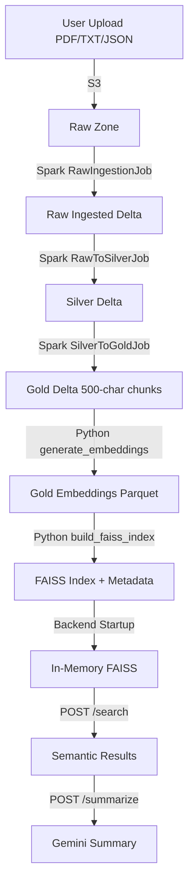

# 📚 LakeRAG Complete Documentation

**Version:** 1.0.0  
**Last Updated:** December 2025  
**Project:** LakeRAG - RAG Lakehouse System

---

## 📑 Table of Contents

1. [System Overview](#1-system-overview)
2. [Architecture](#2-architecture)
3. [Components](#3-components)
4. [Frontend Integration](#4-frontend-integration)
5. [Prerequisites](#5-prerequisites)
6. [Setup Guide](#6-setup-guide)
7. [Running the Pipeline](#7-running-the-pipeline)
8. [API Documentation](#8-api-documentation)
9. [Data Flow](#9-data-flow)
10. [Troubleshooting](#10-troubleshooting)
11. [Known Issues](#11-known-issues)

---

## 1. System Overview

### **What is LakeRAG?**

LakeRAG is a production-grade **Retrieval-Augmented Generation (RAG) system** built on a modern data lakehouse architecture. It processes unstructured documents (PDFs, text files, JSON) through a multi-stage ETL pipeline, generates semantic embeddings, and provides intelligent search and summarization capabilities.

### **Key Features**

- ✅ **Multi-format Ingestion**: PDF, TXT, JSON support via Apache Spark
- ✅ **Delta Lake**: ACID transactions, time travel, schema evolution
- ✅ **Medallion Architecture**: Raw → Silver → Gold layers
- ✅ **Semantic Search**: BGE-large-en-v1.5 embeddings + FAISS indexing
- ✅ **AI Summarization**: Google Gemini 2.0 Flash integration
- ✅ **Orchestration**: Apache Airflow for workflow management
- ✅ **Containerized**: Full Docker Compose deployment

### **Use Cases**

1. **Document Q&A**: Ask questions about uploaded documents
2. **Resume Screening**: Semantic search across candidate profiles
3. **Knowledge Base**: Build searchable documentation repositories
4. **Content Summarization**: AI-powered document summarization

---

## 2. Architecture

### **High-Level System Design**

```
┌─────────────────────────────────────────────────────────────────────┐
│                          USER UPLOADS                               │
│              PDFs, TXT, JSON → S3 (s3://lakerag-arun-bootcamp/raw/) │
└─────────────────────────────────────────────────────────────────────┘
                                    ↓
┌─────────────────────────────────────────────────────────────────────┐
│                     SCALA + SPARK ETL PIPELINE                      │
│  ┌──────────────┐  ┌──────────────┐  ┌──────────────┐               │
│  │ Raw Ingestion│→ │ Raw → Silver │→ │Silver → Gold │               │
│  └──────────────┘  └──────────────┘  └──────────────┘               │
│   Extract Text     Clean & Dedupe    Chunk (500 chars)              │
│   → Delta Lake     → Delta Lake      → Delta Lake                   │
└─────────────────────────────────────────────────────────────────────┘
                                    ↓
┌─────────────────────────────────────────────────────────────────────┐
│                   PYTHON EMBEDDINGS PIPELINE                        │
│  ┌──────────────────┐         ┌────────────────────┐                │
│  │Generate Embeddings│    →   │ Build FAISS Index  │                │
│  └──────────────────┘         └────────────────────┘                │
│   BGE-large-en-v1.5           IndexFlatIP (cosine)                  │
│   → S3 Parquet                → S3 (.faiss + metadata)              │
└─────────────────────────────────────────────────────────────────────┘
                                    ↓
┌─────────────────────────────────────────────────────────────────────┐
│                        FASTAPI BACKEND                              │
│  ┌────────────────┐         ┌─────────────────────┐                 │
│  │  POST /search  │         │   POST /summarize   │                 │
│  │  (Semantic)    │         │   (Gemini 2.0)      │                 │
│  └────────────────┘         └─────────────────────┘                 │
│   FAISS Retrieval            RAG-based Summary                      │
└─────────────────────────────────────────────────────────────────────┘
```

### **Technology Stack**

| Component | Technology | Version | Purpose |
|-----------|-----------|---------|---------|
| **Orchestration** | Apache Airflow | 2.8.1 | Workflow scheduling |
| **Data Processing** | Apache Spark | 3.5.0 | Distributed ETL |
| **Language** | Scala | 2.12.18 | Spark job development |
| **Data Lake** | Delta Lake | 3.2.0 | ACID transactions |
| **Storage** | AWS S3 | - | Object storage |
| **Embeddings** | BGE-large-en | 1024-dim | Vector generation |
| **Vector DB** | FAISS (CPU) | - | Similarity search |
| **API** | FastAPI | Python 3.10 | REST endpoints |
| **LLM** | Gemini 2.0 Flash | - | Summarization |
| **Containers** | Docker Compose | - | Service orchestration |

---

## 3. Components

### **3.1 Scala ETL Module** (`scala-etl/`)

**Purpose**: Transform raw documents into structured, queryable data.

#### **Jobs**

1. **RawIngestionJob** ([`jobs.RawIngestionJob`](scala-etl/src/main/scala/jobs/RawIngestionJob.scala))
   - Reads files from `s3://lakerag-arun-bootcamp/raw/`
   - Extracts text using format-specific extractors:
     - **PDF**: Apache PDFBox
     - **TXT**: UTF-8 text reader
     - **JSON**: Native Spark JSON reader
   - Writes to Delta Lake: `s3://lakerag-arun-bootcamp/raw_ingested/`

2. **RawToSilverJob** ([`jobs.RawToSilverJob`](scala-etl/src/main/scala/jobs/RawToSilverJob..scala))
   - Reads from `raw_ingested/`
   - **Data Quality Checks**:
     - Removes null content
     - Cleans HTML tags
     - Normalizes whitespace
   - **Deduplication**: SHA-256 content hashing
   - **Enrichment**: Adds `doc_id`, `content_hash`, `silver_timestamp`
   - Writes to: `s3://lakerag-arun-bootcamp/silver/`

3. **SilverToGoldJob** ([`jobs.SilverToGoldJob`](scala-etl/src/main/scala/jobs/SilverToGoldJob.scala))
   - Reads from `silver/`
   - **Chunking**: Splits text into 500-character segments
   - **Metadata**: Preserves `doc_id`, `file_path`, `chunk_index`
   - Writes to: `s3://lakerag-arun-bootcamp/gold/`

#### **Delta Lake Schema**

**Gold Layer** ([`schema.GoldSchema`](scala-etl/src/main/scala/schema/GoldSchema.scala)):
```scala
case class GoldRecord(
  chunk_id: String,         // UUID for each chunk
  doc_id: String,           // Document identifier
  file_path: String,        // Original S3 path
  chunk_text: String,       // 500-char text segment
  chunk_index: Int,         // Sequential chunk number
  content_hash: String,     // SHA-256 of original content
  ingested_at: Timestamp,   // Raw ingestion timestamp
  gold_timestamp: Timestamp // Gold layer processing time
)
```

---

### **3.2 Python Embeddings Module** (`embeddings/`)

**Purpose**: Generate vector embeddings and build searchable FAISS index.

#### **Scripts**

1. **[`generate_embeddings.py`](embeddings/generate_embeddings.py)**
   - Reads Gold Delta table from S3
   - Loads **BAAI/bge-large-en-v1.5** model (1024-dim)
   - Generates embeddings:
     - Batch size: 32
     - Normalization: L2 (cosine similarity)
   - Saves to S3: `gold-embeddings/embeddings_YYYYMMDD_HHMMSS.parquet`

2. **[`build_faiss_index.py`](embeddings/build_faiss_index.py)**
   - Reads embeddings from S3
   - Builds **IndexFlatIP** (inner product = cosine for normalized vectors)
   - Uploads to S3:
     - `vector-index/index_YYYYMMDD_HHMMSS.faiss`
     - `vector-index/metadata_YYYYMMDD_HHMMSS.parquet`

#### **Model Details**

| Parameter | Value |
|-----------|-------|
| **Model** | BAAI/bge-large-en-v1.5 |
| **Dimensions** | 1024 |
| **Context Length** | 512 tokens |
| **Score Range** | 0.0 - 1.0 (cosine similarity) |

---

### **3.3 Airflow DAGs** (`airflow/dags/`)

**Purpose**: Orchestrate end-to-end pipeline execution.

#### **DAGs**

1. **[`lakerag_etl_pipeline`](airflow/dags/run_etl.py)** - Full production pipeline
   ```python
   raw_ingestion → raw_to_silver → silver_to_gold → generate_embeddings → build_faiss_index
   ```
   - **Trigger**: Manual
   - **Parallelism**: 8 tasks max
   - **Retry**: 1 attempt per task

2. **[`test_embeddings_only`](airflow/dags/test_embeddings_only.py)** - Development testing
   ```python
   generate_embeddings → build_faiss_index
   ```
   - **Use Case**: Test embeddings without running Scala jobs

#### **Operator Types**

| Task | Operator | Purpose |
|------|----------|---------|
| `raw_ingestion` | SparkSubmitOperator | Submits Scala JAR to Spark cluster |
| `generate_embeddings` | DockerOperator | Runs Python script in embeddings container |

---

### **3.4 FastAPI Backend** (`backend/`)

**Purpose**: Provide REST APIs for search and summarization.

#### **Endpoints**

##### **1. Semantic Search** - `POST /search/`

**Request**:
```json
{
  "query": "What are the technical skills?",
  "k": 5
}
```

**Response**:
```json
{
  "query": "What are the technical skills?",
  "count": 3,
  "results": [
    {
      "rank": 1,
      "score": 0.8234,
      "doc_id": "abc123...",
      "chunk_index": 2,
      "text": "Skills: Python, Scala, Docker, AWS S3..."
    }
  ]
}
```

**Out-of-Context Detection**:
- **Threshold**: 0.65 absolute, 0.85 relative
- Returns empty results if query is unrelated to indexed content

##### **2. Document Summarization** - `POST /summarize/`

**Mode 1: Query-Based**
```json
{
  "query": "Summarize work experience",
  "k": 5
}
```

**Mode 2: Full Document**
```json
{
  "doc_id": "abc123..."
}
```

**Response**:
```json
{
  "query": "Summarize work experience",
  "doc_id": "abc123...",
  "chunks_used": 3,
  "summary": "John Doe has 3 years of experience as a Software Engineer..."
}
```

##### **3. Health Check** - `GET /health`

```bash
curl http://localhost:8000/health
# {"status": "ok"}
```

---

## 4. Frontend Integration

### **4.1 Next.js Frontend Overview**

The LakeRAG frontend is a modern web application built with **Next.js 14** using the App Router architecture. It provides a user-friendly interface for document management, semantic search, and AI-powered summarization.

**Technology Stack**:
- **Framework**: Next.js 14 with TypeScript
- **Styling**: Tailwind CSS 4
- **UI Components**: Lucide React icons
- **API Client**: Axios for HTTP requests
- **AWS SDK**: @aws-sdk/client-s3 for S3 operations

**Port**: http://localhost:3000

---

### **4.2 Frontend Pages**

#### **Home Page** (`/`)
Landing page with system overview and quick navigation to all features.

**Features**:
- System introduction
- Feature highlights with icons
- Technology stack display
- Quick links to main functionalities

#### **Search Page** (`/search`)
Semantic search interface for querying documents.

**Features**:
- Natural language query input
- Configurable result count (k parameter)
- Real-time search results with scores
- Display of document IDs and chunk indices
- Result ranking by relevance

**User Flow**:
1. Enter search query (e.g., "What are the technical skills?")
2. Adjust number of results (default: 5)
3. Click "Search" to retrieve results
4. View ranked results with similarity scores

#### **Summarize Page** (`/summarize`)
AI-powered document summarization interface.

**Features**:
- Two modes of operation:
  - **Query-based**: Search and summarize matching documents
  - **Document-specific**: Summarize by document ID
- Configurable chunk count for context
- Gemini 2.0 Flash-powered summaries
- Display of source document information

**User Flow**:
1. Choose mode: Query or Document ID
2. Enter query or paste document ID
3. Set number of chunks to use (default: 5)
4. Click "Summarize" to generate summary
5. View AI-generated summary with metadata

#### **Upload Page** (`/upload`)
Document upload interface with drag-and-drop support.

**Features**:
- Drag-and-drop file upload
- Click-to-browse file selection
- Multiple file format support (PDF, TXT, JSON)
- Progress indicators
- Upload confirmation
- Automatic S3 storage in `raw/` folder

**User Flow**:
1. Drag files or click to browse
2. Select documents to upload
3. Files automatically uploaded to S3
4. Confirmation message on success
5. Files ready for ETL processing

#### **Files Page** (`/files`)
S3 bucket file management interface.

**Features**:
- List all files in S3 bucket
- Display file sizes and modification dates
- Delete files with confirmation dialog
- Refresh to see latest changes
- Search/filter functionality
- Folder navigation support

**User Flow**:
1. View all uploaded files
2. Check file details (size, date)
3. Delete unwanted files
4. Refresh to see new uploads

---

### **4.3 Frontend-Backend Integration**

#### **API Communication**

The frontend communicates with the FastAPI backend through the API client (`lib/api.ts`).

**Base Configuration**:
```typescript
const API_BASE_URL = process.env.NEXT_PUBLIC_BACKEND_URL || 'http://localhost:8000';
```

**API Functions**:

1. **Search API**
```typescript
export async function searchDocuments(query: string, k: number = 5) {
  const response = await axios.post(`${API_BASE_URL}/search/`, {
    query,
    k
  });
  return response.data;
}
```

2. **Summarize API**
```typescript
export async function summarizeDocuments(params: {
  query?: string;
  doc_id?: string;
  k?: number;
}) {
  const response = await axios.post(`${API_BASE_URL}/summarize/`, params);
  return response.data;
}
```

#### **S3 Operations**

S3 operations are handled through Next.js API routes to keep AWS credentials secure.

**API Routes** (`app/api/s3/`):

1. **List Files** - `GET /api/s3/list`
```typescript
// Returns list of all files in S3 bucket
{
  files: [
    { key: "raw/document.pdf", size: 123456, lastModified: "2025-12-04" }
  ]
}
```

2. **Upload File** - `POST /api/s3/upload`
```typescript
// Uploads file to S3 raw/ folder
// Request: FormData with file
// Response: { success: true, key: "raw/document.pdf" }
```

3. **Delete File** - `DELETE /api/s3/delete`
```typescript
// Deletes file from S3
// Request: { key: "raw/document.pdf" }
// Response: { success: true }
```

---

### **4.4 Environment Configuration**

#### **Frontend Environment Variables** (`.env.local`)

```env
# Backend API endpoint
NEXT_PUBLIC_BACKEND_URL=http://localhost:8000

# AWS Configuration (for S3 operations)
AWS_REGION=ap-south-1
AWS_ACCESS_KEY_ID=your_access_key_id
AWS_SECRET_ACCESS_KEY=your_secret_access_key
S3_BUCKET_NAME=lakerag-arun-bootcamp
BUCKET_NAME=lakerag-arun-bootcamp
```

**Notes**:
- `NEXT_PUBLIC_*` variables are exposed to the browser
- AWS credentials are kept server-side in API routes
- Backend URL must be accessible from user's browser

---

### **4.5 Component Architecture**

#### **Key Components** (`components/`)

1. **Navbar.tsx**
```typescript
// Navigation bar with links to all pages
// Highlights active page
// Responsive mobile menu
```

2. **SearchBar.tsx**
```typescript
// Search input and results display
// Props: query, results, loading state
// Handles search submission and result rendering
```

3. **SummarizeForm.tsx**
```typescript
// Summarization interface
// Supports query and doc_id modes
// Displays generated summaries with metadata
```

4. **FileUploader.tsx**
```typescript
// Drag-and-drop file upload
// File validation
// Progress indicators
// Upload to S3 via API route
```

5. **FileManager.tsx**
```typescript
// File list display
// Delete confirmation dialogs
// Refresh functionality
// File metadata display
```

---

### **4.6 Development Workflow**

#### **Running Frontend Locally**

```bash
cd client

# Install dependencies
npm install

# Start development server
npm run dev

# Access at http://localhost:3000
```

#### **Building for Production**

```bash
# Build optimized production bundle
npm run build

# Start production server
npm start
```

#### **Linting & Formatting**

```bash
# Run ESLint
npm run lint

# Auto-fix issues
npm run lint -- --fix
```

---

### **4.7 Frontend-Backend Data Flow**

```text
┌─────────────────────────────────────────────────────────────────┐
│                        USER INTERACTION                          │
│                    (Browser @ localhost:3000)                    │
└─────────────────────────────────────────────────────────────────┘
                              │
              ┌───────────────┼───────────────┐
              │               │               │
        Upload Page     Search Page    Summarize Page
              │               │               │
              ▼               ▼               ▼
     ┌──────────────┐  ┌──────────────┐  ┌──────────────┐
     │ Next.js API  │  │  API Client  │  │  API Client  │
     │   Routes     │  │   (Axios)    │  │   (Axios)    │
     └──────────────┘  └──────────────┘  └──────────────┘
              │               │               │
              │               └───────┬───────┘
              │                       │
              ▼                       ▼
        ┌──────────────────────────────────────┐
        │      AWS S3 Bucket                   │
        │   (raw/, silver/, gold/)             │
        └──────────────────────────────────────┘
                       │
                       ▼
        ┌──────────────────────────────────────┐
        │    FastAPI Backend                   │
        │  (localhost:8000)                    │
        │  - POST /search/                     │
        │  - POST /summarize/                  │
        │  - GET /health                       │
        └──────────────────────────────────────┘
                       │
              ┌────────┴────────┐
              ▼                 ▼
     ┌─────────────┐    ┌─────────────┐
     │ FAISS Index │    │ Gemini API  │
     │  (Vectors)  │    │   (LLM)     │
     └─────────────┘    └─────────────┘
```

---

### **4.8 Security Considerations**

#### **Credentials Management**

1. **Never expose AWS credentials in browser**
   - Use Next.js API routes for S3 operations
   - Keep credentials in `.env.local` (server-side only)
   - Add `.env.local` to `.gitignore`

2. **CORS Configuration**
   - Backend must allow frontend origin
   - Configure in `backend/main.py`:
```python
from fastapi.middleware.cors import CORSMiddleware

app.add_middleware(
    CORSMiddleware,
    allow_origins=["http://localhost:3000"],
    allow_credentials=True,
    allow_methods=["*"],
    allow_headers=["*"],
)
```

3. **API Key Protection**
   - Gemini API key stored in backend `.env`
   - Never sent to frontend
   - Backend validates all requests

---

### **4.9 Troubleshooting Frontend Issues**

#### **Issue: Cannot Connect to Backend**

**Symptoms**:
- Search/Summarize returns errors
- Network errors in browser console

**Solutions**:
1. Verify backend is running: `curl http://localhost:8000/health`
2. Check `NEXT_PUBLIC_BACKEND_URL` in `.env.local`
3. Ensure CORS is configured in backend
4. Check browser console for error details

#### **Issue: S3 Upload Fails**

**Symptoms**:
- Upload returns 500 error
- "Access Denied" messages

**Solutions**:
1. Verify AWS credentials in `.env.local`
2. Check S3 bucket exists: `aws s3 ls s3://lakerag-arun-bootcamp/`
3. Verify IAM permissions
4. Check bucket region matches `AWS_REGION`

#### **Issue: Search Returns No Results**

**Symptoms**:
- Search completes but shows no results
- Empty results array

**Solutions**:
1. Verify FAISS index exists in backend
2. Check backend logs: `docker-compose logs backend`
3. Ensure ETL pipeline has been run
4. Try broader search queries

#### **Issue: Page Not Loading**

**Symptoms**:
- Blank page or errors
- TypeScript compilation errors

**Solutions**:
```bash
# Clear Next.js cache
rm -rf .next

# Reinstall dependencies
rm -rf node_modules package-lock.json
npm install

# Rebuild
npm run build
```

---

## 5. Prerequisites

### **4.1 Hardware Requirements**

| Resource | Minimum | Recommended | Notes |
|----------|---------|-------------|-------|
| **CPU** | 4 cores | 8+ cores | For Spark parallelism |
| **RAM** | 8 GB | 16+ GB | Spark + embeddings model |
| **Storage** | 20 GB | 50+ GB | Docker images + data |
| **Network** | Stable internet | High bandwidth | S3 access + model downloads |

### **4.2 Software Requirements**

1. **Docker** 20.10+ ([Install Guide](https://docs.docker.com/get-docker/))
2. **Docker Compose** 2.0+ ([Install Guide](https://docs.docker.com/compose/install/))
3. **AWS CLI** 2.0+ ([Install Guide](https://docs.aws.amazon.com/cli/latest/userguide/getting-started-install.html))
4. **SBT (Scala Build Tool)** 1.9+ ([Install Guide](https://www.scala-sbt.org/download.html))
5. **Java JDK** 17+ ([Install Guide](https://adoptium.net/))

**Verification Commands**:
```bash
docker --version          # Docker version 20.10+
docker-compose --version  # Docker Compose version 2.0+
aws --version             # aws-cli/2.0+
sbt --version             # sbt version 1.9+
java -version             # openjdk 17+
```

### **4.3 AWS Setup**

#### **Step 1: Create S3 Bucket**
```bash
aws s3 mb s3://lakerag-arun-bootcamp --region ap-south-1
```

#### **Step 2: Create IAM User**

**Required Permissions**:
```json
{
  "Version": "2012-10-17",
  "Statement": [
    {
      "Effect": "Allow",
      "Action": [
        "s3:GetObject",
        "s3:PutObject",
        "s3:ListBucket",
        "s3:DeleteObject"
      ],
      "Resource": [
        "arn:aws:s3:::lakerag-arun-bootcamp",
        "arn:aws:s3:::lakerag-arun-bootcamp/*"
      ]
    }
  ]
}
```

#### **Step 3: Configure Credentials**
```bash
aws configure
# Enter: AWS Access Key ID
# Enter: AWS Secret Access Key
# Region: ap-south-1
# Output format: json
```

### **4.4 Gemini API Key**

1. Visit [Google AI Studio](https://makersuite.google.com/app/apikey)
2. Create new API key
3. Save for `.env` configuration

---

## 5. Setup Guide

### **Step 1: Clone Repository**

```bash
git clone https://github.com/kalviumcommunity/LakeRAG_Arun-Kumar-S_Josys-Bootcamp
cd LakeRAG_Arun-Kumar-S_Josys-Bootcamp
```

### **Step 2: Create Environment File**

Create [`.env`](.env) in project root:

```bash
# ===========================
# AWS Credentials
# ===========================
AWS_ACCESS_KEY_ID=AKIA...
AWS_SECRET_ACCESS_KEY=...
AWS_REGION=ap-south-1

# ===========================
# S3 Configuration
# ===========================
BUCKET_NAME=lakerag-arun-bootcamp

# ===========================
# Airflow Database
# ===========================
POSTGRES_USER=airflow
POSTGRES_PASSWORD=airflow
POSTGRES_DB=airflow

# ===========================
# Airflow Admin User
# ===========================
AIRFLOW_ADMIN_USERNAME=admin
AIRFLOW_ADMIN_PASSWORD=admin
AIRFLOW_ADMIN_FIRSTNAME=Admin
AIRFLOW_ADMIN_LASTNAME=User
AIRFLOW_ADMIN_EMAIL=admin@example.com

# ===========================
# Airflow Security Keys
# ===========================
FERNET_KEY=<generate-below>
SECRET_KEY=<generate-below>

# ===========================
# Gemini API
# ===========================
GEMINI_API_KEY=AIza...

# ===========================
# Logging
# ===========================
LOG_LEVEL=info
```

**Generate Security Keys**:
```bash
# Fernet Key
python3 -c "from cryptography.fernet import Fernet; print(Fernet.generate_key().decode())"

# Secret Key
openssl rand -hex 16
```

### **Step 3: Build Scala JAR**

```bash
cd scala-etl

# Clean previous builds
sbt clean

# Build fat JAR with all dependencies
sbt assembly

# Verify JAR exists (~50-80 MB)
ls -lh target/scala-2.12/lakerag-etl.jar

cd ..
```

**Expected Output**:
```
[success] Total time: 45 s
[info] Built JAR: target/scala-2.12/lakerag-etl.jar
```

### **Step 4: Prepare Test Data**

```bash
# Create test directory
mkdir -p test_data

# Create sample document
cat > test_data/sample_resume.txt << 'EOF'
John Doe - Senior Software Engineer

Professional Summary:
Experienced software engineer with 5+ years in data engineering and machine learning.
Specializes in building scalable ETL pipelines and RAG systems.

Technical Skills:
- Languages: Python, Scala, SQL
- Frameworks: Spark, Delta Lake, FastAPI
- Cloud: AWS (S3, EMR, Lambda)
- ML: Sentence Transformers, FAISS, LangChain

Work Experience:

Senior Data Engineer | Tech Corp | 2021-Present
- Built ETL pipelines processing 10TB+ data daily
- Implemented real-time streaming with Kafka
- Deployed microservices on AWS EKS

Data Engineer | StartupXYZ | 2019-2021
- Developed data lakehouse on Delta Lake
- Created ML feature store
- Optimized Spark jobs (50% cost reduction)

Education:
B.Tech in Computer Science, IIT Delhi (2019)
EOF

# Upload to S3
aws s3 cp test_data/sample_resume.txt s3://lakerag-arun-bootcamp/raw/

# Verify upload
aws s3 ls s3://lakerag-arun-bootcamp/raw/
```

### **Step 5: Build Docker Images**

```bash
# Build all services (takes 5-10 minutes first time)
docker-compose build

# Verify images created
docker images | grep lakerag
```

**Expected Output**:
```
lakerag-airflow                                    latest    abc123    5 minutes ago    1.8GB
lakerag_arun-kumar-s_josys-bootcamp_embeddings     latest    def456    8 minutes ago    1.5GB
lakerag_arun-kumar-s_josys-bootcamp_backend        latest    ghi789    3 minutes ago    800MB
```

### **Step 6: Start Services**

```bash
# Start all containers in background
docker-compose up -d

# Watch services start (wait ~2 minutes)
watch -n 2 'docker-compose ps'
```

**Wait until all services show "Up"**:
```
NAME                     STATUS
postgres                 Up
spark                    Up
spark-worker             Up
airflow-webserver        Up
airflow-scheduler        Up
backend                  Up
embeddings               Up
```

### **Step 7: Verify Services**

```bash
# Check Airflow UI
curl -s http://localhost:8080/health | jq

# Check Spark Master
curl -s http://localhost:8081 | grep "Spark Master"

# Check Backend Health
curl http://localhost:8000/health
```

**All checks should pass** ✅

---

## 6. Running the Pipeline

### **6.1 Access Airflow UI**

1. Open browser: **http://localhost:8080**
2. Login:
   - **Username**: `admin`
   - **Password**: `admin`

### **6.2 Trigger Full Pipeline**

1. Find DAG: **`lakerag_etl_pipeline`**
2. Click ▶️ **"Trigger DAG"**
3. Click **"Trigger"** to confirm

### **6.3 Monitor Execution**

#### **Task Timeline**

```
┌──────────────┐  2 min   ┌──────────────┐  1 min   ┌──────────────┐
│raw_ingestion │────────▶ │raw_to_silver │────────▶ │silver_to_gold│
└──────────────┘          └──────────────┘          └──────────────┘
                                                            │
                                                            │ 3 min
                                                            ▼
                                                  ┌─────────────────────┐
                                                  │generate_embeddings │
                                                  └─────────────────────┘
                                                            │
                                                            │ 30 sec
                                                            ▼
                                                  ┌─────────────────────┐
                                                  │ build_faiss_index   │
                                                  └─────────────────────┘
```

**Total Duration**: ~7-10 minutes (for 10 documents)

#### **View Task Logs**

**Method 1: Airflow UI**
1. Click on task (e.g., `generate_embeddings`)
2. Click **"Log"** button
3. Watch real-time execution

**Method 2: Docker Logs**
```bash
# Watch all scheduler logs
docker-compose logs -f airflow-scheduler

# Filter specific task
docker-compose logs airflow-scheduler | grep "generate_embeddings"
```

### **6.4 Verify Outputs**

```bash
# Check Delta tables created
aws s3 ls s3://lakerag-arun-bootcamp/raw_ingested/_delta_log/
aws s3 ls s3://lakerag-arun-bootcamp/silver/_delta_log/
aws s3 ls s3://lakerag-arun-bootcamp/gold/_delta_log/

# Check embeddings generated
aws s3 ls s3://lakerag-arun-bootcamp/gold-embeddings/

# Check FAISS index built
aws s3 ls s3://lakerag-arun-bootcamp/vector-index/
```

**Expected S3 Structure**:
```
s3://lakerag-arun-bootcamp/
├── raw/
│   └── sample_resume.txt
├── raw_ingested/
│   ├── _delta_log/
│   │   ├── 00000000000000000000.json
│   │   └── 00000000000000000001.json
│   └── part-00000-*.parquet
├── silver/
│   ├── _delta_log/
│   └── part-00000-*.parquet
├── gold/
│   ├── _delta_log/
│   └── part-00000-*.parquet
├── gold-embeddings/
│   └── embeddings_20241203_143022.parquet
└── vector-index/
    ├── index_20241203_143100.faiss
    └── metadata_20241203_143100.parquet
```

### **6.5 Backend Index Loading**

The backend automatically downloads FAISS index on startup:

```bash
# Watch backend logs
docker-compose logs -f backend

# Look for:
# 📥 Downloading FAISS index from S3...
# 🚀 Search service ready. FAISS size: 123
```

**If index not loaded**, restart backend:
```bash
docker-compose restart backend
```

---

## 7. API Documentation

### **7.1 Semantic Search**

#### **Endpoint**: `POST /search/`

**Purpose**: Find relevant document chunks using semantic similarity.

#### **Request Schema**

```json
{
  "query": "string (required)",
  "k": "integer (optional, default: 5)"
}
```

#### **Example: Skills Search**

```bash
curl -X POST http://localhost:8000/search/ \
  -H "Content-Type: application/json" \
  -d '{
    "query": "What are the technical skills?",
    "k": 5
  }'
```

**Response**:
```json
{
  "query": "What are the technical skills?",
  "count": 3,
  "results": [
    {
      "rank": 1,
      "score": 0.8734,
      "doc_id": "a1b2c3d4-e5f6-7890-abcd-ef1234567890",
      "chunk_index": 2,
      "text": "Technical Skills:\n- Languages: Python, Scala, SQL\n- Frameworks: Spark, Delta Lake, FastAPI\n- Cloud: AWS (S3, EMR, Lambda)..."
    },
    {
      "rank": 2,
      "score": 0.7891,
      "doc_id": "a1b2c3d4-e5f6-7890-abcd-ef1234567890",
      "chunk_index": 4,
      "text": "Senior Data Engineer | Tech Corp | 2021-Present\n- Built ETL pipelines processing 10TB+ data daily..."
    },
    {
      "rank": 3,
      "score": 0.7234,
      "doc_id": "a1b2c3d4-e5f6-7890-abcd-ef1234567890",
      "chunk_index": 0,
      "text": "John Doe - Senior Software Engineer\n\nProfessional Summary:\nExperienced software engineer..."
    }
  ]
}
```

#### **Example: Out-of-Context Query**

```bash
curl -X POST http://localhost:8000/search/ \
  -H "Content-Type: application/json" \
  -d '{
    "query": "What is the weather today?",
    "k": 5
  }'
```

**Response**:
```json
{
  "query": "What is the weather today?",
  "count": 0,
  "results": [],
  "message": "Out of context — no relevant match found"
}
```

#### **Score Interpretation**

| Score Range | Interpretation | Action |
|-------------|----------------|--------|
| **0.85 - 1.0** | Highly relevant | Use with confidence |
| **0.70 - 0.84** | Moderately relevant | Review context |
| **0.65 - 0.69** | Weakly relevant | Verify manually |
| **< 0.65** | Out of context | Rejected automatically |

---

### **7.2 Document Summarization**

#### **Endpoint**: `POST /summarize/`

**Purpose**: Generate AI-powered summaries using Google Gemini 2.0.

#### **Request Schema**

```json
{
  "query": "string (optional)",
  "doc_id": "string (optional)",
  "k": "integer (optional, default: 5)"
}
```

**Note**: Must provide **either** `query` OR `doc_id`, not both.

---

#### **Mode 1: Query-Based Summarization**

**Use Case**: Answer specific questions from documents.

```bash
curl -X POST http://localhost:8000/summarize/ \
  -H "Content-Type: application/json" \
  -d '{
    "query": "Summarize the work experience",
    "k": 5
  }'
```

**Response**:
```json
{
  "query": "Summarize the work experience",
  "doc_id": "a1b2c3d4-e5f6-7890-abcd-ef1234567890",
  "chunks_used": 3,
  "summary": "John Doe has 5+ years of experience in data engineering and machine learning. As a Senior Data Engineer at Tech Corp (2021-Present), he built ETL pipelines processing 10TB+ data daily and implemented real-time streaming with Kafka. Previously, at StartupXYZ (2019-2021), he developed a data lakehouse on Delta Lake and optimized Spark jobs, achieving a 50% cost reduction."
}
```

---

#### **Mode 2: Full Document Summarization**

**Use Case**: Get complete overview of a document.

```bash
curl -X POST http://localhost:8000/summarize/ \
  -H "Content-Type: application/json" \
  -d '{
    "doc_id": "a1b2c3d4-e5f6-7890-abcd-ef1234567890"
  }'
```

**Response**:
```json
{
  "query": null,
  "doc_id": "a1b2c3d4-e5f6-7890-abcd-ef1234567890",
  "chunks_used": 8,
  "summary": "John Doe is a Senior Software Engineer with 5+ years of experience in data engineering and machine learning. He holds a B.Tech in Computer Science from IIT Delhi (2019). His technical expertise includes Python, Scala, SQL, Spark, Delta Lake, FastAPI, and AWS services. He has built large-scale ETL pipelines processing 10TB+ data daily, implemented real-time streaming solutions, and deployed microservices on AWS EKS. His work has resulted in significant cost optimizations and improved data processing efficiency."
}
```

---

#### **Prompt Engineering**

The system uses different prompts for each mode:

**Query Mode Prompt**:
```
You are an expert information extractor.

Your task is to answer ONLY based on details from the context that are relevant to the user's query.
If the context contains information NOT related to the query, ignore it completely.

Do NOT add assumptions, do NOT infer additional facts, and do NOT mention unrelated topics.
Be concise.

### User Query:
{query}

### Context:
{context}

### Answer (only about the query):
```

**Document Mode Prompt**:
```
You are an expert summarizer.

Write a concise and well-structured summary of the entire document using the provided context.
Avoid filler text and repetition. Focus on the major points across all chunks.

### Context:
{context}

### Summary:
```

---

### **7.3 Health Check**

#### **Endpoint**: `GET /health`

**Purpose**: Verify backend service is running.

```bash
curl http://localhost:8000/health
```

**Response**:
```json
{
  "status": "ok"
}
```

---

## 8. Data Flow

### **8.1 End-to-End Data Journey**



### **8.2 Layer Schemas**

#### **Raw Ingested Layer**

```sql
CREATE TABLE raw_ingested (
  file_path STRING,
  content STRING,
  ingested_at TIMESTAMP
) USING DELTA
LOCATION 's3://lakerag-arun-bootcamp/raw_ingested/'
```

#### **Silver Layer** ([`schema.SilverSchema`](scala-etl/src/main/scala/schema/SilverSchema.scala))

```sql
CREATE TABLE silver (
  doc_id STRING,              -- UUID
  file_path STRING,
  content STRING,             -- Cleaned text
  ingested_at TIMESTAMP,
  content_hash STRING,        -- SHA-256
  silver_timestamp TIMESTAMP,
  source_system STRING,       -- 'LakeRAG-Scala-ETL'
  language STRING             -- 'unknown'
) USING DELTA
LOCATION 's3://lakerag-arun-bootcamp/silver/'
```

#### **Gold Layer** ([`schema.GoldSchema`](scala-etl/src/main/scala/schema/GoldSchema.scala))

```sql
CREATE TABLE gold (
  chunk_id STRING,            -- UUID
  doc_id STRING,              -- FK to silver
  file_path STRING,
  chunk_text STRING,          -- 500 chars
  chunk_index INT,            -- Sequential number
  content_hash STRING,        -- Original doc hash
  ingested_at TIMESTAMP,
  gold_timestamp TIMESTAMP
) USING DELTA
LOCATION 's3://lakerag-arun-bootcamp/gold/'
```

#### **Embeddings (Parquet)**

```sql
CREATE TABLE gold_embeddings (
  chunk_id STRING,
  doc_id STRING,
  chunk_index INT,
  chunk_text STRING,
  embedding ARRAY<FLOAT>      -- 1024-dim vector
)
LOCATION 's3://lakerag-arun-bootcamp/gold-embeddings/'
```

#### **FAISS Metadata (Parquet)**

```sql
CREATE TABLE vector_index_metadata (
  chunk_id STRING,
  doc_id STRING,
  chunk_index INT,
  chunk_text STRING,
  faiss_index INT             -- Position in FAISS
)
LOCATION 's3://lakerag-arun-bootcamp/vector-index/'
```

---

### **8.3 Data Quality Checks**

#### **Raw Ingestion** ([`RawReader.scala`](scala-etl/src/main/scala/etl/raw/RawReader.scala))

```scala
val dqFailed = df.filter(
  col("file_path").isNull ||
  col("content").isNull ||
  length(trim(col("content"))) < 1
)
```

**Action**: Log bad rows, write only valid data.

#### **Silver Transformation** ([`SilverTransformer.scala`](scala-etl/src/main/scala/etl/silver/SilverTransformer.scala))

```scala
// 1. Remove control characters & HTML
val cleaned = raw
  .withColumn("content",
    regexp_replace(col("content"), "\\p{Cntrl}", " ")
  )
  .withColumn("content",
    regexp_replace(col("content"), "<[^>]*>", " ")
  )

// 2. Deduplicate by content hash
val w = Window.partitionBy("content_hash").orderBy(col("ingested_at").desc)
val deduped = withHash
  .withColumn("rn", row_number().over(w))
  .filter(col("rn") === 1)
```

#### **Gold Transformation** ([`GoldTransformer.scala`](scala-etl/src/main/scala/etl/gold/GoldTransformer.scala))

```scala
val dq = silver
  .filter(col("doc_id").isNotNull && length(trim(col("doc_id"))) > 0)
  .filter(col("file_path").isNotNull)
  .filter(col("content").isNotNull)
```

---

## 9. Troubleshooting

### **9.1 Common Issues**

#### **Issue: DAG Not Appearing in Airflow**

**Symptoms**:
- DAG missing from UI
- Scheduler logs show parse errors

**Diagnosis**:
```bash
# Check scheduler logs
docker-compose logs airflow-scheduler | grep -i error

# Manually test DAG import
docker-compose exec airflow-scheduler python -c "
from airflow.models import DagBag
dagbag = DagBag(dag_folder='/opt/airflow/dags')
print('DAGs:', list(dagbag.dags.keys()))
print('Errors:', dagbag.import_errors)
"
```

**Solutions**:
1. **Verify DAG file exists**:
```bash
docker-compose exec airflow-scheduler ls -lh /opt/airflow/dags/
```

2. **Check Python syntax**:
```bash
docker-compose exec airflow-scheduler python /opt/airflow/dags/run_etl.py
```

3. **Restart scheduler**:
```bash
docker-compose restart airflow-scheduler
```

---

#### **Issue: Scala Job Fails - JAR Not Found**

**Symptoms**:
- `raw_ingestion` task fails
- Error: `FileNotFoundError: /opt/etl/lakerag-etl.jar`

**Diagnosis**:
```bash
# Check if JAR exists locally
ls -lh scala-etl/target/scala-2.12/lakerag-etl.jar

# Check if mounted in container
docker-compose exec airflow-scheduler ls -lh /opt/etl/
```

**Solutions**:
1. **Rebuild JAR**:
```bash
cd scala-etl && sbt clean assembly && cd ..
```

2. **Verify volume mount** in [`docker-compose.yml`](docker-compose.yml):
```yaml
volumes:
  - ./scala-etl/target/scala-2.12:/opt/etl  # Must be present
```

3. **Restart Airflow**:
```bash
docker-compose restart airflow-scheduler
```

---

#### **Issue: Python Task Fails - Image Not Found**

**Symptoms**:
- `generate_embeddings` fails
- Error: `404 Client Error: Image not found`

**Diagnosis**:
```bash
# Check if embeddings image exists
docker images | grep embeddings

# Check DAG force_pull setting
grep "force_pull" airflow/dags/run_etl.py
```

**Solutions**:
1. **Build embeddings image**:
```bash
docker-compose build embeddings
```

2. **Verify `force_pull=False`** in [`run_etl.py`](airflow/dags/run_etl.py):
```python
generate_embeddings = DockerOperator(
    force_pull=False,  # Must be False for local images
    # ...
)
```

3. **Restart scheduler**:
```bash
docker-compose restart airflow-scheduler
```

---

#### **Issue: AWS Credentials Error**

**Symptoms**:
- S3 access denied
- Tasks fail with `boto3.exceptions.NoCredentialsError`

**Diagnosis**:
```bash
# Test AWS CLI access
aws s3 ls s3://lakerag-arun-bootcamp/

# Verify .env credentials
grep AWS_ .env

# Check env vars in container
docker-compose exec airflow-scheduler env | grep AWS
```

**Solutions**:
1. **Update `.env` file** with valid credentials
2. **Restart all services**:
```bash
docker-compose down && docker-compose up -d
```

---

#### **Issue: Spark Connection Refused**

**Symptoms**:
- SparkSubmitOperator fails
- Error: `Connection refused: spark:7077`

**Diagnosis**:
```bash
# Check Spark master status
docker-compose ps spark

# View Spark logs
docker-compose logs spark

# Test Spark UI
curl http://localhost:8081
```

**Solutions**:
1. **Restart Spark cluster**:
```bash
docker-compose restart spark spark-worker
```

2. **Verify Spark is healthy**:
```bash
# Should show 1 worker connected
curl -s http://localhost:8081 | grep "Workers"
```

---

#### **Issue: Backend Search Returns Empty**

**Symptoms**:
- `/search` returns no results
- Backend logs show `FAISS index not found`

**Diagnosis**:
```bash
# Check if FAISS index exists in container
docker-compose exec backend ls -lh /app/local_data/faiss/

# Check backend logs
docker-compose logs backend | grep "FAISS"
```

**Solutions**:
1. **Trigger embeddings pipeline**:
   - In Airflow UI, run `lakerag_etl_pipeline`
   - Wait for `build_faiss_index` task to complete

2. **Verify S3 has index**:
```bash
aws s3 ls s3://lakerag-arun-bootcamp/vector-index/
```

3. **Restart backend** to download index:
```bash
docker-compose restart backend
docker-compose logs -f backend  # Watch download
```

---

#### **Issue: Out of Memory Errors**

**Symptoms**:
- Containers killed unexpectedly
- `docker ps -a` shows `OOMKilled`

**Diagnosis**:
```bash
# Check Docker resource usage
docker stats

# Check available memory
free -h
```

**Solutions**:
1. **Increase Docker memory**:
   - Docker Desktop → Settings → Resources → Memory → **8 GB+**

2. **Reduce Spark memory** in [`run_etl.py`](airflow/dags/run_etl.py):
```python
SPARK_CONF = {
    "spark.executor.memory": "1g",  # Reduce from 2g
    "spark.driver.memory": "1g",
}
```

3. **Reduce embeddings batch size** in [`generate_embeddings.py`](embeddings/generate_embeddings.py):
```python
embeddings = model.encode(
    texts,
    batch_size=16,  # Reduce from 32
)
```

4. **Restart services**:
```bash
docker-compose down && docker-compose up -d
```

---

### **9.2 Debug Commands**

#### **View Service Logs**

```bash
# All services
docker-compose logs

# Specific service
docker-compose logs -f airflow-scheduler

# Filter by keyword
docker-compose logs airflow-scheduler | grep "ERROR"

# Last 100 lines
docker-compose logs --tail=100 backend
```

#### **Enter Container Shell**

```bash
# Airflow scheduler
docker-compose exec airflow-scheduler bash

# Backend
docker-compose exec backend bash

# Spark master
docker-compose exec spark bash
```

#### **Check Service Health**

```bash
# All services status
docker-compose ps

# Airflow health
curl http://localhost:8080/health

# Backend health
curl http://localhost:8000/health

# Spark master
curl http://localhost:8081
```

#### **Inspect Volumes**

```bash
# List volumes
docker volume ls | grep lakerag

# Inspect volume
docker volume inspect lakerag_arun-kumar-s_josys-bootcamp_postgres-db-volume

# Remove unused volumes
docker volume prune
```

---

## 10. Known Issues

### **10.1 Critical Limitations**

| Issue | Impact | Workaround | Priority |
|-------|--------|------------|----------|
| **Fixed chunk size (500 chars)** | Context loss at boundaries | Use overlapping chunks | High |
| **FAISS IndexFlatIP** | Slow for >10K vectors | Switch to IndexHNSWFlat | High |
| **No retry logic for S3** | Transient failures | Manual task retry | Medium |
| **Hardcoded paths** | Container portability | Use env vars | Medium |

### **10.2 Performance Bottlenecks**

| Component | Bottleneck | Impact | Mitigation |
|-----------|-----------|--------|-----------|
| **BGE-large CPU** | ~3s per 100 chunks | Long embedding time | Use GPU or smaller model |
| **Spark local mode** | Single machine | Slow for large datasets | Deploy on EMR/Databricks |
| **No caching** | Repeated S3 downloads | Increased latency | Add Redis cache |

### **10.3 Data Quality Gaps**

| Layer | Missing Check | Risk | Priority |
|-------|--------------|------|----------|
| **Raw** | File size validation | Large PDFs crash | Medium |
| **Silver** | Language detection | Mixed languages | Low |
| **Gold** | Chunk overlap | Context loss | High |

### **10.4 Operational Gaps**

| Area | Gap | Impact | Priority |
|------|-----|--------|----------|
| **Monitoring** | No alerting | Silent failures | High |
| **Logging** | Not centralized | Hard to debug | Medium |
| **Backup** | No S3 versioning | Data loss risk | High |
| **Security** | `.env` in plaintext | Credentials exposed | High |

---

## 11. Additional Resources

- **Airflow Documentation**: https://airflow.apache.org/docs/
- **Delta Lake Guide**: https://docs.delta.io/latest/index.html
- **FAISS Wiki**: https://github.com/facebookresearch/faiss/wiki
- **Sentence Transformers**: https://www.sbert.net/
- **Gemini API**: https://ai.google.dev/docs
- **Project Repository**: https://github.com/kalviumcommunity/LakeRAG_Arun-Kumar-S_Josys-Bootcamp

---

**Document Version**: 1.0.0  
**Last Updated**: December 2025  
**Maintained By**: Arun Kumar S  
**Contact**: arun.ofc09@gmail.com